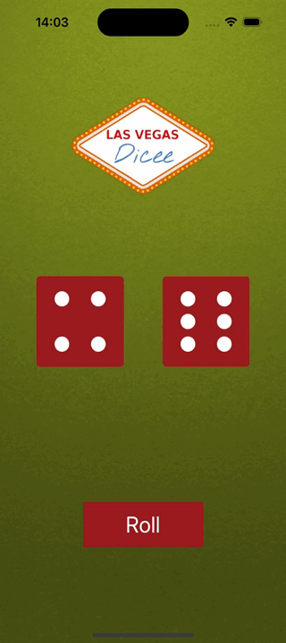

#  Dicee Swift App

## What was do in this app

Make a Las Vegas dice app. You can make the die roll at the press of a button or by shaking your phone. With this app in your pocket, you’ll be fully set up to settle any score on the go!

## What was used to make this app

* The Swift Programming Language
* Storyboard
* Collection Types - Arrays
* UI elements such as UILabel, UIButton, UIImageView, UIStackView

## Example what the application do

